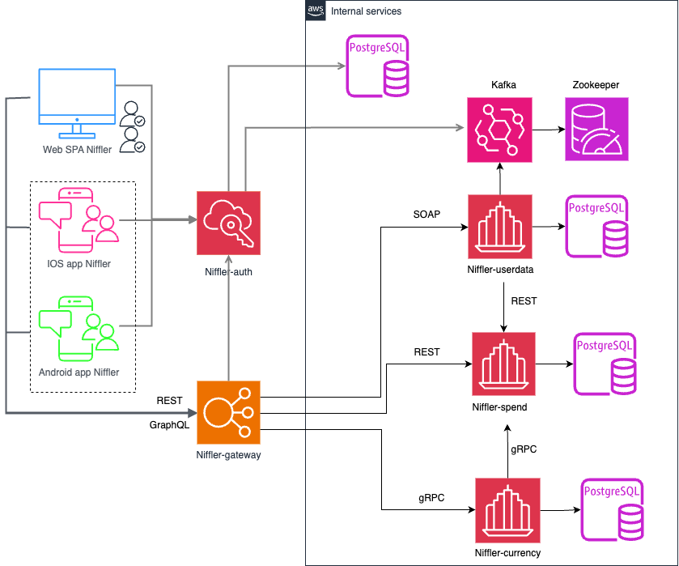

## **Технологии, использованные в Niffler 2.0**

- [Spring Authorization Server](https://spring.io/projects/spring-authorization-server)
- [Spring OAuth 2.0 Resource Server](https://docs.spring.io/spring-security/reference/servlet/oauth2/resource-server/index.html)
- [Spring data JPA](https://spring.io/projects/spring-data-jpa)
- [Spring Web](https://docs.spring.io/spring-framework/docs/current/reference/html/web.html#spring-web)
- [Spring actuator](https://docs.spring.io/spring-boot/docs/current/reference/html/actuator.html)
- [Spring gRPC by https://github.com/yidongnan](https://yidongnan.github.io/grpc-spring-boot-starter/en/server/getting-started.html)
- [Spring web-services](https://docs.spring.io/spring-ws/docs/current/reference/html/)
- [Apache Kafka](https://developer.confluent.io/quickstart/kafka-docker/)
- [Docker](https://www.docker.com/resources/what-container/)
- [Docker-compose](https://docs.docker.com/compose/)
- [Postgres](https://www.postgresql.org/about/)
- [React](https://ru.reactjs.org/docs/getting-started.html)
- [GraphQL](https://graphql.org/)
- [Thymeleaf](https://www.thymeleaf.org/)
- [Jakarta Bean Validation](https://beanvalidation.org/)
- [Jakarta JAXB](https://eclipse-ee4j.github.io/jaxb-ri/)
- [JUnit 5 (Extensions, Resolvers, etc)](https://junit.org/junit5/docs/current/user-guide/)
- [Retrofit 2](https://square.github.io/retrofit/)
- [Allure](https://docs.qameta.io/allure/)
- [Selenide](https://selenide.org/)
- [Selenoid & Selenoid-UI](https://aerokube.com/selenoid/latest/)
- [Allure-docker-service](https://github.com/fescobar/allure-docker-service)
- [Java 21](https://adoptium.net/en-GB/temurin/releases/)
- [Gradle 8.6](https://docs.gradle.org/8.6/release-notes.html)
- [GHA](https://docs.github.com/en/actions)
- И многие другие

Рекомендуемые материалы к просмотру (прочтению):

- [Implementing an OAuth 2 authorization server with Spring Security - the new way! by Laurentiu Spilca](https://youtu.be/DaUGKnA7aro)
- [Full Stack OAuth 2 - With Spring Security / React / Angular Part 1](https://youtu.be/SfNIjS_2H4M)
- [Full Stack OAuth 2 - With Spring Security / React / Angular Part 2](https://youtu.be/3bGer6-6mdY)
- [Spring Data? Да, та! by Евгений Борисов](https://youtu.be/nwM7A4TwU3M)
- [Spring – Глубоко и не очень by Евгений Борисов](https://youtu.be/nGfeSo52_8A)
- [Spring-потрошитель, часть 1 by Евгений Борисов](https://youtu.be/BmBr5diz8WA)
- [Spring-потрошитель, часть 2 by Евгений Борисов](https://youtu.be/cou_qomYLNU)
- [Spring-построитель by Евгений Борисов](https://youtu.be/rd6wxPzXQvo)
- [Перенимаем опыт Google в построении микросервисов с gRPC by Александр Борисов](https://youtu.be/zPbaKUIcFx0)
- [Designing a friendships database structure: Should I use a multivalued column?](https://dba.stackexchange.com/questions/135941/designing-a-friendships-database-structure-should-i-use-a-multivalued-column)
- [Гонсалвес Э.: Изучаем Java EE 7, глава "Глава 4. Java.Persistence.API"](https://www.litres.ru/book/entoni-gonsalves/izuchaem-java-ee-7-8480934/otzivi/)
- [(Hopefully) the final article about equals and hashCode for JPA entities with DB-generated IDs](https://jpa-buddy.com/blog/hopefully-the-final-article-about-equals-and-hashcode-for-jpa-entities-with-db-generated-ids/)
-

**Схема проекта Niffler 2.0**



# Минимальные предусловия для работы с проектом Niffler

#### 0. Если у вас ОС Windows

Во-первых, и в-главных, необходимо использовать [bash terminal](https://www.geeksforgeeks.org/working-on-git-bash/), а
не powershell.
[Полезное и короткое видео о git bash](https://www.youtube.com/watch?v=zM9Mb-otqww)
Во-вторых, если у вас что-то не работает - пишите в TG чат группы - будем вместе дополнять README, т.к. изначально
проект разработан под nix

#### 1. Установить docker (Если не установлен)

Мы будем использовать docker для БД (Postgres), кроме того, будем запускать микросервисы в едином docker network при
помощи docker-compose

[Установка на Windows](https://docs.docker.com/desktop/install/windows-install/)

[Установка на Mac](https://docs.docker.com/desktop/install/mac-install/) (Для ARM и Intel разные пакеты)

[Установка на Linux](https://docs.docker.com/desktop/install/linux-install/)

После установки и запуска docker daemon необходимо убедиться в работе команд docker, например `docker -v`:

```posh
User-MacBook-Pro ~ % docker -v
Docker version 20.10.14, build a224086
```

#### 2. Спуллить контейнер postgres:15.1, zookeeper и kafka версии 7.3.2

```posh
docker pull postgres:15.1
docker pull confluentinc/cp-zookeeper:7.3.2
docker pull confluentinc/cp-kafka:7.3.2
```

После `pull` вы увидите спуленный image командой `docker images`

```posh
mitriis-MacBook-Pro ~ % docker images            
REPOSITORY                 TAG              IMAGE ID       CREATED         SIZE
postgres                   15.1             9f3ec01f884d   10 days ago     379MB
confluentinc/cp-kafka      7.3.2            db97697f6e28   12 months ago   457MB
confluentinc/cp-zookeeper  7.3.2            6fe5551964f5   7 years ago     451MB

```

#### 3. Создать volume для сохранения данных из БД в docker на вашем компьютере

```posh
docker volume create pgdata
```

#### 4. Запустить БД, zookeeper и kafka 3-мя последовательными командами:

Запустив скрипт (Для Windows необходимо использовать bash terminal: gitbash, cygwin или wsl)

```posh
User-MacBook-Pro  niffler % bash localenv.sh
```

Или выполнив последовательно команды, для *nix:

```posh
docker run --name niffler-all -p 5432:5432 -e POSTGRES_PASSWORD=secret -e CREATE_DATABASES=niffler-auth,niffler-currency,niffler-spend,niffler-userdata -e TZ=GMT+3 -e PGTZ=GMT+3 -v pgdata:/var/lib/postgresql/data -v ./postgres/script:/docker-entrypoint-initdb.d -d postgres:15.1 --max_prepared_transactions=100

docker run --name=zookeeper -e ZOOKEEPER_CLIENT_PORT=2181 -p 2181:2181 -d confluentinc/cp-zookeeper:7.3.2

docker run --name=kafka -e KAFKA_BROKER_ID=1 \
-e KAFKA_ZOOKEEPER_CONNECT=$(docker inspect zookeeper --format='{{ .NetworkSettings.IPAddress }}'):2181 \
-e KAFKA_ADVERTISED_LISTENERS=PLAINTEXT://localhost:9092 \
-e KAFKA_OFFSETS_TOPIC_REPLICATION_FACTOR=1 \
-e KAFKA_TRANSACTION_STATE_LOG_MIN_ISR=1 \
-e KAFKA_TRANSACTION_STATE_LOG_REPLICATION_FACTOR=1 \
-p 9092:9092 -d confluentinc/cp-kafka:7.3.2
```

Для Windows (Необходимо использовать bash terminal: gitbash, cygwin или wsl):

```posh
docker run --name niffler-all -p 5432:5432 -e POSTGRES_PASSWORD=secret -e CREATE_DATABASES=niffler-auth,niffler-currency,niffler-spend,niffler-userdata -e TZ=GMT+3 -e PGTZ=GMT+3 -v pgdata:/var/lib/postgresql/data -v ./postgres/script:/docker-entrypoint-initdb.d -d postgres:15.1 --max_prepared_transactions=100

docker run --name=zookeeper -e ZOOKEEPER_CLIENT_PORT=2181 -p 2181:2181 -d confluentinc/cp-zookeeper:7.3.2

docker run --name=kafka -e KAFKA_BROKER_ID=1 -e KAFKA_ZOOKEEPER_CONNECT=$(docker inspect zookeeper --format="{{ .NetworkSettings.IPAddress }}"):2181 -e KAFKA_ADVERTISED_LISTENERS=PLAINTEXT://localhost:9092 -e KAFKA_OFFSETS_TOPIC_REPLICATION_FACTOR=1 -e KAFKA_TRANSACTION_STATE_LOG_MIN_ISR=1 -e KAFKA_TRANSACTION_STATE_LOG_REPLICATION_FACTOR=1 -p 9092:9092 -d confluentinc/cp-kafka:7.3.2
```

[Про IP zookeeper](https://github.com/confluentinc/cp-docker-images/issues/801#issuecomment-692085103)

Если вы используете Windows и контейнер с БД не стартует с ошибкой в логе:

```
server started
/usr/local/bin/docker-entrypoint.sh: running /docker-entrypoint-initdb.d/init-database.sh
/usr/local/bin/docker-entrypoint.sh: /docker-entrypoint-initdb.d/init-database.sh: /bin/bash^M: bad interpreter: No such file or directory
```

То необходимо выполнить следующие команды в каталоге /postgres :

```
sed -i -e 's/\r$//' init-database.sh
chmod +x init-database.sh
```

#### 5. Установить Java версии 21. Это необходимо, т.к. проект использует синтаксис Java 21

Версию установленной Java необходимо проверить командой `java -version`

```posh
User-MacBook-Pro ~ % java -version
openjdk version "21.0.1" 2023-10-17 LTS
OpenJDK Runtime Environment Temurin-21.0.1+12 (build 21.0.1+12-LTS)
OpenJDK 64-Bit Server VM Temurin-21.0.1+12 (build 21.0.1+12-LTS, mixed mode)
```

Если у вас несколько версий Java одновременно - то хотя бы одна из них должна быть 21
Если java не установлена вовсе, то рекомендую установить OpenJDK (например,
из https://adoptium.net/en-GB/temurin/releases/)

#### 6. Установить пакетый менеджер для сборки front-end npm

[Инструкция](https://docs.npmjs.com/downloading-and-installing-node-js-and-npm).
Рекомендованная версия Node.js - 22.6.0

# Запуск Niffler локальное в IDE:

#### 1. Выбрать какой фронтенд предполагается запускать - REST или GraphQL, и перейти в соответсвующий каталог

для REST:

```posh
User-MacBook-Pro niffler % cd niffler-ng-client
```

или для GraphQL **_(временно недоступно)_**:

```posh
User-MacBook-Pro niffler % cd niffler-ng-client-gql
```

#### 2. Запустить фронтенд в режиме preview (сначала обновить зависимости)

```posh
User-MacBook-Pro niffler-ng-client % npm i
User-MacBook-Pro niffler-ng-client % npm run build:dev
```

Если требуется dev режим (вы собираетесь править frontend и на лету видеть изменения), запускаем командой `npm run dev`

#### 3. Прописать run конфигурацию для всех сервисов niffler-* - Active profiles local

Для этого зайти в меню Run -> Edit Configurations -> выбрать main класс -> указать Active profiles: local
[Инструкция](https://stackoverflow.com/questions/39738901/how-do-i-activate-a-spring-boot-profile-when-running-from-intellij).

#### 4 Запустить сервис Niffler-auth c помощью gradle или командой Run в IDE:

- Запустить сервис auth

```posh
User-MacBook-Pro niffler % cd niffler-auth
User-MacBook-Pro niffler-auth % gradle bootRun --args='--spring.profiles.active=local'
```

Или просто перейдя к main-классу приложения NifflerAuthApplication выбрать run в IDEA (предварительно удостовериться что
выполнен предыдущий пункт)

#### 5  Запустить в любой последовательности другие сервисы: niffler-currency, niffler-spend, niffler-gateway, niffler-userdata

Фронтенд Niffler при запуске локально будет работать для вас по адресу http://127.0.0.1:3000/,
OpenAPI (Swagger) сервиса niffler-gateway доступен по адресу: http://127.0.0.1:8090/swagger-ui/index.html
GraphiQL интерфейс сервиса niffler-gateway доступен по адресу: http://127.0.0.1:8090/graphiql
WSDL сервиса niffler-userdata доступен по адресу: http://127.0.0.1:8089/ws/userdata.wsdl

# Запуск Niffler в докере:

#### 1. Создать бесплатную учетную запись на https://hub.docker.com/ (если отсутствует)

#### 2. Создать в настройках своей учетной записи access_token

[Инструкция](https://docs.docker.com/docker-hub/access-tokens/).

#### 3. Выполнить docker login с созданным access_token (в инструкции это описано)

#### 4. Прописать в etc/hosts элиас для Docker-имени

- frontend:  127.0.0.1 frontend.niffler.dc,
- auth:      127.0.0.1 auth.niffler.dc
- gateway:   127.0.0.1 gateway.niffler.dc

```posh
User-MacBook-Pro niffler % vi /etc/hosts
```

```posh
##
# Host Database
#
# localhost is used to configure the loopback interface
# when the system is booting.  Do not change this entry.
##
127.0.0.1       localhost
127.0.0.1       frontend.niffler.dc
127.0.0.1       auth.niffler.dc
127.0.0.1       gateway.niffler.dc
```

#### 5. Перейти в корневой каталог проекта

```posh
User-MacBook-Pro niffler % cd niffler
```

#### 6. Запустить все сервисы, если необходим фронтенд GraphQL, то это указывается аргументом к скрипту:

для REST:

```posh
User-MacBook-Pro  niffler % bash docker-compose-dev.sh
```

для GraphQL **_(временно недоступно)_**:

```posh
User-MacBook-Pro  niffler % bash docker-compose-dev.sh gql
```

Текущая версия `docker-compose-dev.sh` **удалит все запущенные Docker контейнеры в системе**, поэтому если у вас есть
созданные
контейнеры для других проектов - отредактируйте строку ```posh docker rm $(docker ps -a -q)```, чтобы включить в grep
только те контейнеры, что непосредственно относятся к niffler.

Фронтенд Niffler при запуске в докере будет работать для вас по адресу http://frontend.niffler.dc,
OpenAPI (Swagger) сервиса niffler-gateway доступен по адресу: http://gateway.niffler.dc:8090/swagger-ui/index.html
GraphiQL интерфейс сервиса niffler-gateway доступен по адресу: http://gateway.niffler.dc:8090/graphiql
WSDL сервиса niffler-userdata доступен по адресу: http://localhost:8089/ws/userdata.wsdl

Если при выполнении скрипта `docker-compose-dev.sh` вы получили ошибку:

```
* What went wrong:
Execution failed for task ':niffler-auth:jibDockerBuild'.
> com.google.cloud.tools.jib.plugins.common.BuildStepsExecutionException: 
Build to Docker daemon failed, perhaps you should make sure your credentials for 'registry-1.docker.io...
```

То необходимо убедиться, что в `$USER/.docker/config.json` файле отсутствует запись `"credsStore": "desktop"`
При наличии такого ключа в json, его надо удалить.
Если файл пустой, то возможно не выполнен `docker login`. Если выполнялся, то надо создать файл руками по пути
`$USER/.docker/config.json`
с содержимым,

```
 {
        "auths": {
                "https://index.docker.io/v1/": {}
        },
        "currentContext": "desktop-linux"
}
```

Если вы не можете подключиться к БД в docker, указывая верные login и password, то возможно у вас поднята другая база на
том же порту 5432 .
Это известная проблема, что Postgres в docker может стартануть при зянятом порту 5432, надо убедиться что у вас не
поднят никакой другой Postgres на этом порту.

Если вы используете Windows и контейнер с БД не стартует с ошибкой в логе:

```
server started
/usr/local/bin/docker-entrypoint.sh: running /docker-entrypoint-initdb.d/init-database.sh
/usr/local/bin/docker-entrypoint.sh: /docker-entrypoint-initdb.d/init-database.sh: /bin/bash^M: bad interpreter: No such file or directory
```

То необходимо выполнить следующие команды в каталоге /postgres :

```
sed -i -e 's/\r$//' init-database.sh
chmod +x init-database.sh
```

# Создание своего docker repository для форка Niffler и сборка своих докер контейнеров

#### 1. Войти в свою УЗ на https://hub.docker.com/ и последовательно создать публичные репозитории

- niffler-ng-client
- niffler-ng-client-gql
- niffler-userdata
- niffler-spend
- niffler-gateway
- niffler-currency
- niffler-auth

Допустим, что ваш username на https://hub.docker.com - *foobazz*

#### 2. заменить в файле docker.properties (в корне проекта) IMAGE_PREFIX=qaguru на IMAGE_PREFIX=foobazz

- где foobazz - ваш юзернэйм на https://hub.docker.com/

#### 3. заменить в файле build.gradle (в корне проекта) dockerHubName = "qaguru" на dockerHubName = "foobazz"

- где foobazz - ваш юзернэйм на https://hub.docker.com/

#### 4. Перейти в корневой каталог проекта

```posh
User-MacBook-Pro niffler % cd niffler
```

#### 5. Собрать все имеджи, запушить и запустить niffler одной командой, если необходим фронтенд GraphQL, то это указывается аргументом к скрипту:

для REST:

```posh
User-MacBook-Pro  niffler % bash docker-compose-dev.sh push
```

для GraphQL **_(временно недоступно)_**:

```posh
User-MacBook-Pro  niffler % bash docker-compose-dev.sh gql push 
```

# Запуск e-2-e тестов в Docker network изолированно Niffler в докере:

#### 1. Перейти в корневой каталог проекта

```posh
User-MacBook-Pro niffler % cd niffler
```

#### 2. Запустить все сервисы и тесты, если необходим фронтенд GraphQL, то это указывается аргументом к скрипту:

для REST:

```posh
User-MacBook-Pro  niffler % bash docker-compose-e2e.sh
```

для GraphQL:

```posh
User-MacBook-Pro  niffler % bash docker-compose-e2e.sh gql
```

#### 3. Selenoid UI доступен по адресу: http://localhost:9090/

#### 4. Allure доступен по адресу: http://localhost:5050/allure-docker-service/projects/niffler-ng/reports/latest/index.html


